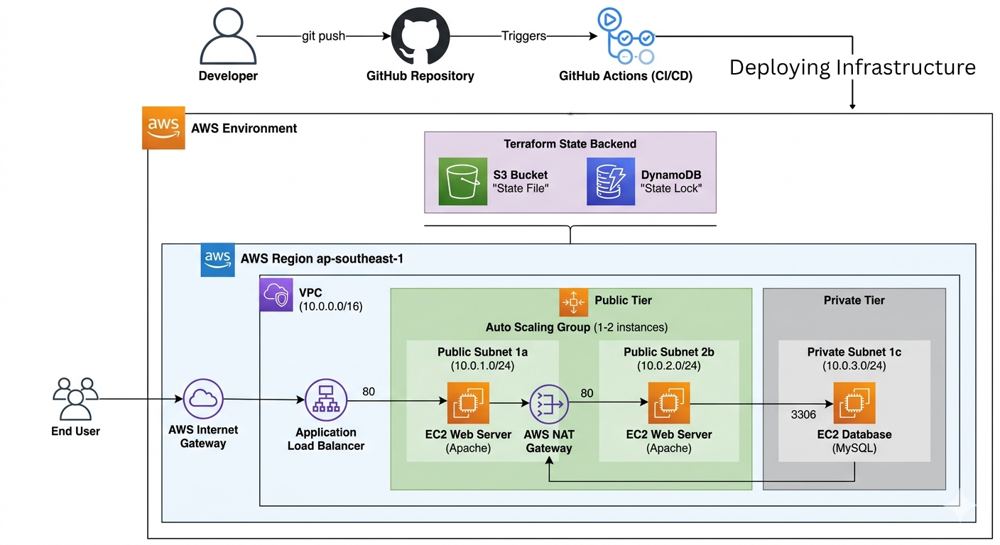
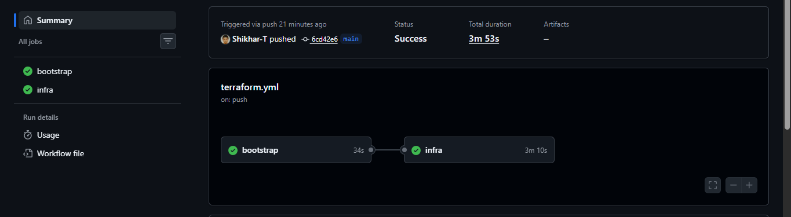
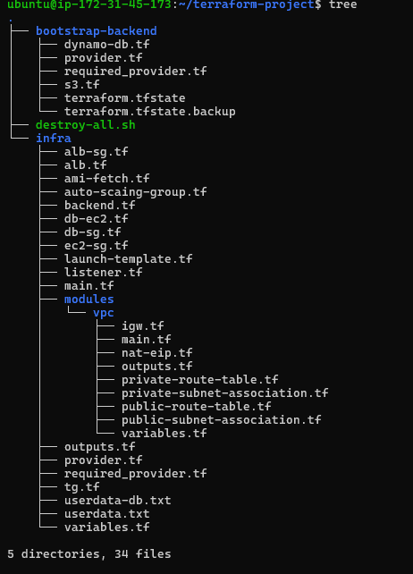

# 🚀 AWS 3-Tier Architecture using Terraform & CI/CD

##📌 Project Overview
This project demonstrates a complete **3-tier architecture on AWS** using Terraform, including networking, compute, load balancing, and remote state management.

---

## 🌍 Region

All resources in this project are deployed in:

```
ap-southeast-1 (Singapore)
```

Make sure your AWS CLI and GitHub Actions are configured for the same region.

---

## 🏗️ Architecture

The infrastructure includes:

* Custom VPC with public & private subnets
* Application Load Balancer (ALB)
* Auto Scaling Group (ASG) with EC2 instances
* Private EC2 instance for database layer
* S3 bucket for Terraform state storage
* DynamoDB table for state locking
* Secure Security Groups configuration

---

## 🔐 IAM & Credentials (Important)

* IAM user with programmatic access is required
* Required permissions: `AdministratorAccess` (for demo purposes)
* Credentials needed:

```
AWS_ACCESS_KEY_ID
AWS_SECRET_ACCESS_KEY
```

---

## ⚙️ AWS CLI

* AWS CLI must be configured with above credentials
* Region used:

```
ap-southeast-1
```

---

## ⚙️ GitHub Actions

* Add the following secrets in your repository:

```
AWS_ACCESS_KEY_ID
AWS_SECRET_ACCESS_KEY
```

---

## ⚙️ CI/CD

* GitHub Actions used for automated Terraform deployment
* Terraform code is executed from the `infra/` directory
* Backend (S3 + DynamoDB) is handled separately

---

## 🔑 SSH Access (Important)

To access EC2 instances:

1. Manually create a key pair in AWS with name:

```
my-key-sg.pem
```

2. Download and store it securely

3. Connect to EC2:

```bash
ssh -i my-key-sg.pem ubuntu@<EC2-Public-IP>
```

---

## 🧨 Destroy Infrastructure (Manual)

To delete the entire infrastructure, use the provided script:

```bash
chmod +x destroy-all.sh
./destroy-all.sh
```

This script will:

* First destroy all infrastructure resources (ALB, EC2, ASG, etc.)
* Then destroy backend resources (S3 and DynamoDB)

---

## 📁 Project Structure

```
.
├── infra/                 # Main infrastructure (VPC, ALB, EC2, ASG)
├── bootstrap-backend/    # S3 + DynamoDB backend setup
├── destroy-all.sh        # Manual destroy script
├── .github/workflows/    # CI/CD pipelines

```

---

## ⚠️ Important Notes

* Backend resources (S3 & DynamoDB) should be created once
* Always destroy infrastructure before backend
* Ensure correct AWS region is configured before deployment
* IAM credentials must be configured before running Terraform

---

## 👨‍💻 Author

Shikhar Tiwari

